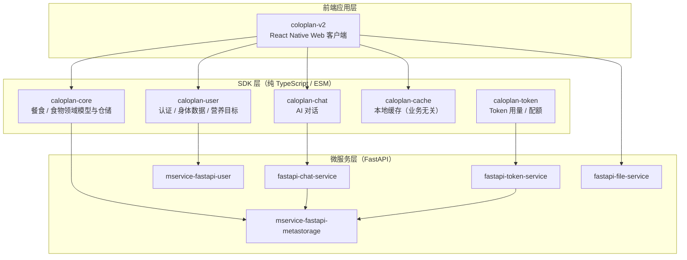

# CaloPlan 🥗

**CaloPlan** 是一个移动优先的 **AI 营养助手**全家桶：拍照 / 对话快速记餐，自动追踪餐食与营养目标，并由 AI 给出营养建议。项目按「**前端应用 → SDK 层 → 微服务层**」三层组织，共 11 个仓库，统一托管于本组织（caloplan）。

## 项目架构




## 仓库清单


| 分层   | 仓库                                                                                       | 说明                                                          |
| ---- | ---------------------------------------------------------------------------------------- | ----------------------------------------------------------- |
| 前端应用 | [coloplan-v2](https://github.com/caloplan/coloplan-v2)                                   | React Native (Web) 客户端：Today / Meals / AI 三个页面，移动优先         |
| SDK  | [caloplan-core](https://github.com/caloplan/caloplan-core)                               | 业务核心：餐食 / 食物领域模型、实体工厂、仓储，对接 meta 服务                         |
| SDK  | [caloplan-user](https://github.com/caloplan/caloplan-user)                               | 用户模块：登录认证、身体数据、营养目标（UserSDK + MetaSDK 业务层封装）                |
| SDK  | [caloplan-chat](https://github.com/caloplan/caloplan-chat)                               | AI 对话 SDK：SSE 流式对话、图片识别、工具调用审批流                             |
| SDK  | [caloplan-cache](https://github.com/caloplan/caloplan-cache)                             | 基础能力：localStorage producer 缓存，业务无关，被各 SDK 复用                |
| SDK  | [caloplan-token](https://github.com/caloplan/caloplan-token)                             | Token 用量 / 配额 SDK：check / consume / usage / quota / remaining       |
| 微服务  | [mservice-fastapi-user](https://github.com/caloplan/mservice-fastapi-user)               | 认证 / 用户 / 身体数据服务（JWT，Python FastAPI）                        |
| 微服务  | [mservice-fastapi-metastorage](https://github.com/caloplan/mservice-fastapi-metastorage) | 食物 / 餐食 / 营养元数据存储服务                                         |
| 微服务  | [fastapi-chat-service](https://github.com/caloplan/fastapi-chat-service)                 | AI 对话服务：Agent + Tool Call + taskid 审批流（deepseek-flash 视觉识别） |
| 微服务  | [fastapi-file-service](https://github.com/caloplan/fastapi-file-service)                 | 图片上传服务（随机 UUID URL 即访问凭证）                                   |
| 微服务  | [fastapi-token-service](https://github.com/caloplan/fastapi-token-service)               | LLM Token 用量 / 配额微服务（check / consume，防滥用，fail-closed）          |

## 核心数据流


* **日常记餐**：Meals 页 → `caloplan-core` 仓储 → `mservice-fastapi-metastorage` 落库（缓存经 `caloplan-cache` 先旧后新渲染）。

* **AI 记餐链路**：AI 页提问 → `caloplan-chat` → `fastapi-chat-service`（Agent + Tool Call）→ 命中需审批工具 → 前端确认 → 服务端执行写入 meta 服务。

* **图片识别**：选图 → `fastapi-file-service` 上传 → 回传图片 URL → `fastapi-chat-service` 视觉识别。

* **账号体系**：Account 页 → `caloplan-user` → `mservice-fastapi-user`（JWT，Token 经 `caloplan-cache` 持久化）。

* **Token 配额**：AI 调用前 `caloplan-token` check 过闸 → 调用后 consume 记账（经 `fastapi-token-service`，落库 `mservice-fastapi-metastorage`，fail-closed 防滥用）。

## 快速开始（本地开发）

### 1. 启动后端（五个微服务）

每个服务目录内均有 `docker-compose.yml`，可单独启动，默认端口与前端配置一致：


| 服务                           | 默认端口   |
| ---------------------------- | ------ |
| mservice-fastapi-user        | `9092` |
| mservice-fastapi-metastorage | `9093` |
| fastapi-file-service         | `9094` |
| fastapi-chat-service         | `9095` |
| fastapi-token-service        | `9096` |


```
cd mservice-fastapi-user && docker compose up -d

\# 其余四个服务同理
```

### 2. 构建 SDK


```
\# caloplan-core / caloplan-user / caloplan-chat / caloplan-cache / caloplan-token

pnpm install

pnpm test      # node:test + tsx

pnpm build     # tsc -p tsconfig.build.json → dist/
```

### 3. 启动前端


```
cd coloplan-v2

pnpm install

cp .env.example .env   # 按需覆盖微服务地址

pnpm dev               # http://localhost:5173
```

## 技术栈


| 层   | 技术                                                      |
| --- | ------------------------------------------------------- |
| 前端  | React Native (Web)、react-native-web、Vite、TypeScript、SWR |
| SDK | TypeScript、ESM、pnpm workspace 风格包                       |
| 后端  | Python、FastAPI、Docker / docker-compose                  |
| 数据  | SQLite（开发默认）、localStorage 缓存                            |

## 其他
* 开发 / 部署配置通过 `.env` 注入（不入库），模板见各仓库 `.env.example`。
